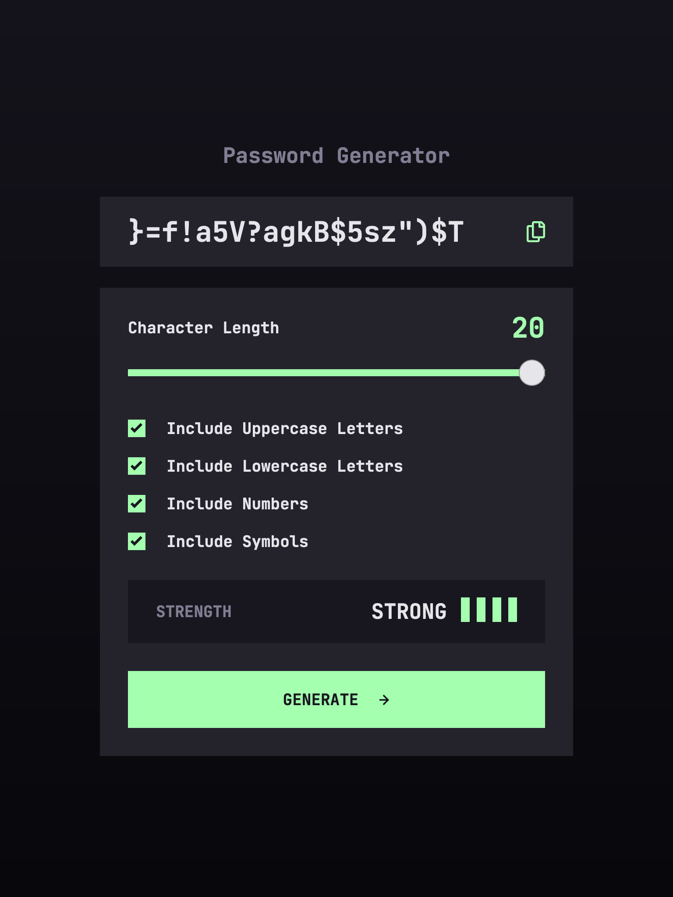

# Password generator app solution - Frontend Mentor

This is a solution to the [Password generator app challenge on Frontend Mentor](https://www.frontendmentor.io/challenges/password-generator-app-Mr8CLycqjh). Frontend Mentor challenges help you improve your coding skills by building realistic projects. 

## Table of contents

- [Overview](#overview)
  - [The challenge](#the-challenge)
  - [Screenshot](#screenshot)
  - [Links](#links)
- [My process](#my-process)
  - [Built with](#built-with)
  - [What I learned](#what-i-learned)
  - [Useful resources](#useful-resources)
- [Author](#author)

## Overview

### The challenge

Users should be able to:

- Generate a password based on the selected inclusion options
- Copy the generated password to the computer's clipboard
- See a strength rating for their generated password
- View the optimal layout for the interface depending on their device's screen size
- See hover and focus states for all interactive elements on the page

### Screenshot



### Links

- Solution URL: [Add solution URL here](https://your-solution-url.com)
- Live Site URL: [Add live site URL here](https://your-live-site-url.com)

## My process

### Built with

- Flexbox
- CSS Grid
- Mobile-first workflow
- [React](https://reactjs.org/) - JS library
- [TypeScript](https://www.typescriptlang.org/) - Programming language
- [Sass](https://sass-lang.com/) - CSS with superpowers

### What I learned

I learned to create a range slider and style it.
Look at this example:

```html
<div class="slidecontainer">
  <input type="range" min="1" max="100" value="50" class="slider" id="myRange">
</div>
```
```css
.slidecontainer {
  width: 100%; /* Width of the outside container */
}

/* The slider itself */
.slider {
  -webkit-appearance: none;  /* Override default CSS styles */
  appearance: none;
  width: 100%; /* Full-width */
  height: 25px; /* Specified height */
  background: #d3d3d3; /* Grey background */
  outline: none; /* Remove outline */
  opacity: 0.7; /* Set transparency (for mouse-over effects on hover) */
  -webkit-transition: .2s; /* 0.2 seconds transition on hover */
  transition: opacity .2s;
}

/* Mouse-over effects */
.slider:hover {
  opacity: 1; /* Fully shown on mouse-over */
}

/* The slider handle (use -webkit- (Chrome, Opera, Safari, Edge) and -moz- (Firefox) to override default look) */ 
.slider::-webkit-slider-thumb {
  -webkit-appearance: none; /* Override default look */
  appearance: none;
  width: 25px; /* Set a specific slider handle width */
  height: 25px; /* Slider handle height */
  background: #04AA6D; /* Green background */
  cursor: pointer; /* Cursor on hover */
}

.slider::-moz-range-thumb {
  width: 25px; /* Set a specific slider handle width */
  height: 25px; /* Slider handle height */
  background: #04AA6D; /* Green background */
  cursor: pointer; /* Cursor on hover */
}
```
[Try it Yourself](https://www.w3schools.com/howto/tryit.asp?filename=tryhow_css_rangeslider). The above code belongs to [w3schools](https://www.w3schools.com/)

And learned how to copy something to clipboard in react:
``` js
navigator.clipboard.writeText(textToCopy);
```
By [Gary Vernon Grubb](https://stackoverflow.com/users/2943174/gary-vernon-grubb) on [StackOverflow](https://stackoverflow.com/a/52033479)

### Useful resources

- [Creating a Range Slider](https://www.w3schools.com/howto/howto_js_rangeslider.asp) - This resource helped helped me to learn creating and styling range sliders.
- [Copy to Clipboard](https://stackoverflow.com/a/52033479) - This [StackOverflow](https://stackoverflow.com/) answer shows how to copy something to clipboard in react.

## Author

- GitHub - [@Artin-GH](http://github.com/Artin-GH/)
- Frontend Mentor - [@Artin-GH](https://www.frontendmentor.io/profile/Artin-GH/)
- Telegram - [@RTn_GH](https://t.me/RTn_GH/)
